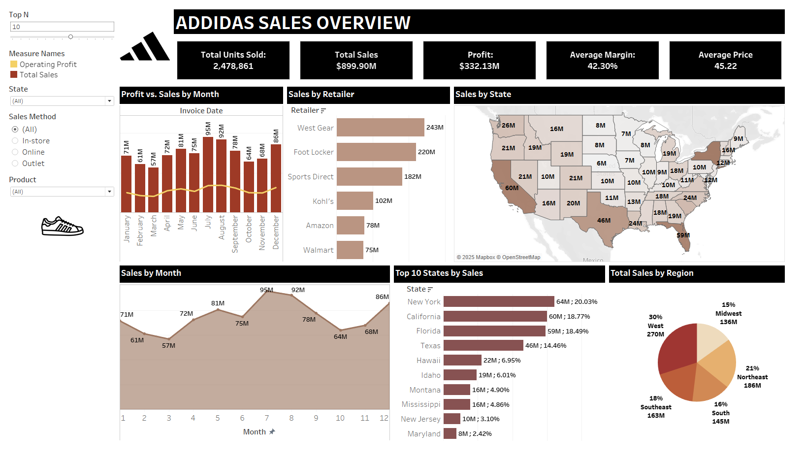
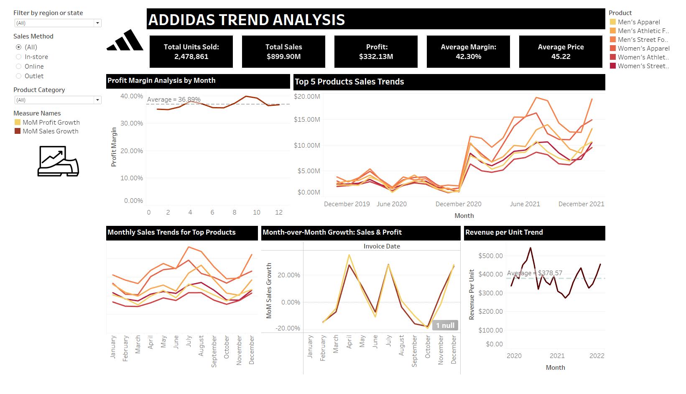
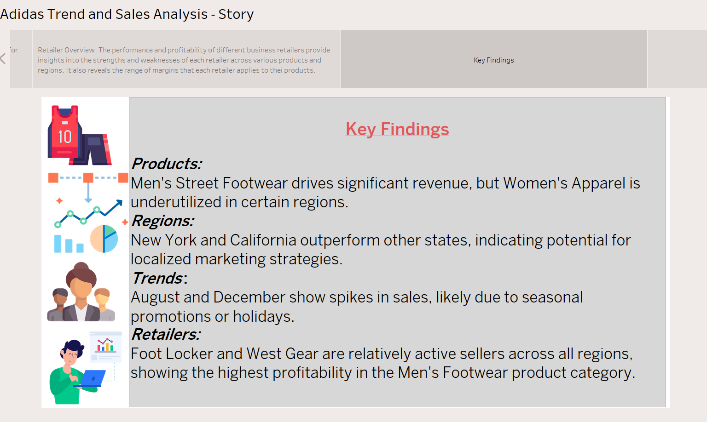

# 🏃‍♂️ Adidas Sales and Trends Analysis 📊

Welcome to the **Adidas Sales and Trends Analysis**! This project provides a comprehensive exploration of sales performance, trends, and actionable insights using Tableau dashboards and visualizations. Below, you'll find an overview of the key insights and dashboards included in this analysis.

Link : https://public.tableau.com/app/profile/kavya.kumary.jayanthi.nair/viz/Adidas_Sales_Analysis_17374408091730/Story

---

## 🌟 Overview

This analysis dives deep into:
- **📦 Product Trends**: Discover which products are leading the charge in different sales methods and regions.
- **🌍 Regional Performance**: Uncover the top-performing states and regions driving Adidas’ growth.
- **📈 Sales Dynamics**: Understand monthly trends, revenue drivers, and operating profits.
- **🚀 Growth Opportunities**: Leverage insights for strategic planning and improved market positioning.

---

## 📊 Dashboards and Insights

### 1. **Adidas Sales Overview** 📋
  

**Key Metrics**:
- **🔝 Top N**: 10
- **💰 Operating Profit**: $332.13M
- **💸 Total Sales**: $899.90M
- **🛍️ Sales Methods**: In-store, Online, Outlet
- **📍 Top States**: New York, California, Florida, Texas

**Profit vs. Sales by Month**:
| Invoice Date | Sales by Retailer | Sales by State |
|--------------|-------------------|----------------|
| 71M          | West Gear         | 243M           |
| 74M          | Foot Locker       | 220M           |
| 73M          | Sports Direct     | 182M           |
| 72M          | Kohl's            | 102M           |
| 72M          | Amazon            | 78M            |
| 72M          | Walmart           | 75M            |

---

### 2. **Adidas Product Performance Analysis** 👟
  

**Key Metrics**:
- **📦 Total Units Sold**: 2,478,861
- **💸 Total Sales**: $899.90M
- **💰 Profit**: $332.13M
- **📊 Average Margin**: 42.30%
- **🏷️ Average Price**: $45.22

**Sales Breakdown by Method and Top Products**:
- **👟 Men's Street Footwear**: 63M
- **👗 Women's Apparel**: 47M
- **👟 Men's Athletic Footwear**: 53M
- **👠 Women's Street Footwear**: 59M

---

### 3. **Adidas Trend Analysis** 📈
  

**Key Metrics**:
- **📈 MoM Profit Growth**: 36.98%
- **📈 MoM Sales Growth**: 42.30%
- **🔝 Top 5 Products Sales Trends**:
  - Men's Street Footwear: 209M
  - Women's Apparel: 179M
  - Men's Athletic Footwear: 154M

**Monthly Sales Trends**:
- **📅 Peak Months**: August and December
- **📅 Lowest Months**: January and February

---

### 4. **Adidas Sales and Trends Story** 📖
(overview.png)  

**Key Findings**:
- **📦 Products**: Men's Street Footwear drives significant revenue, but Women's Apparel is underutilized in certain regions.
- **🌍 Regions**: New York and California outperform other states.
- **📈 Trends**: August and December show spikes in sales due to seasonal promotions or holidays.
- **🛍️ Retailers**: Foot Locker and West Gear are the most profitable retailers.

---

## 🛠️ How to Use This Analysis
1. Open the Tableau workbook (`workbook.twbx`) in Tableau Desktop or Tableau Reader.
2. Explore the dashboards and visualizations to gain insights into Adidas' sales performance.
3. Use the filters (e.g., region, product category, sales method) to drill down into specific data points.
4. Leverage the insights for strategic decision-making and market positioning.

---

## 📝 Notes
- This analysis was created using Tableau version X.X.
- Data sources include Adidas sales data from various regions and retailers.
- For any questions or further analysis, feel free to reach out! 📧

---

## 📜 License
This project is licensed under the MIT License. See the `LICENSE` file for details.

---

## 🙌 Thank You!
Thank you for exploring the **Adidas Sales and Trends Analysis**! We hope this analysis provides valuable insights and helps drive data-driven decisions. 🚀
